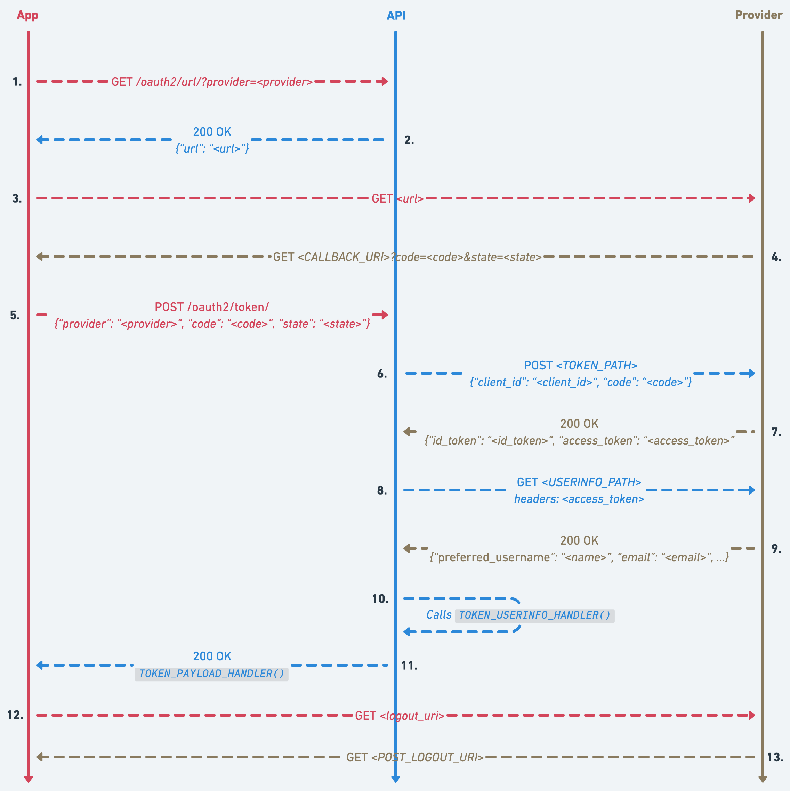

# OAuth 2.0 Authorization Code Flow

The Authorization Code Flow (defined in [OAuth 2.0 RFC 6749, §4.1](https://datatracker.ietf.org/doc/html/rfc6749#section-4.1))
exchanges a short-lived authorization code for tokens.

## 1) Retrieve the authorization URL from the API

The client application (**App**) requests the authorization URL from the backend (**API**)
using `GET /oauth2/url/?provider=<provider>`.

## 2) The API generates the authorization URL

The API generates a unique `state` and builds the authorization URL using the
provider’s `AUTHORIZATION_PATH` and configured settings (`CLIENT_ID`, `REDIRECT_URI`, etc.),
then returns it to the App.

## 3) Redirect the user to the provider

The App redirects the browser to the provider’s authorization endpoint using that URL.

## 4) The user is redirected back to the App

After the user authenticates and authorizes the application, the provider redirects
back to the App’s `REDIRECT_URI` with an authorization `code` and the original `state`.

## 5) The App sends the code to the API

The App sends `code` and `state` to the API via `POST /oauth2/token/`.

## 6) The API exchanges the code for tokens

The API verifies the `state` (and `code_verifier` if PKCE is enabled) and exchanges the
`code` for tokens using the provider’s `TOKEN_PATH` and configured settings.

## 7) The provider returns tokens to the API

The provider validates the code and returns an ID Token, Access Token, and optionally a
Refresh Token to the API.

## 8) The API retrieves user info

The API uses the Access Token to fetch user information from the provider’s `USERINFO_PATH`.

## 9) The provider returns user info to the API

The provider returns user information (e.g., `sub`, `email`, `preferred_username`)
according to the scopes requested in the authorization URL.

## 10) The API creates or updates the user

The API creates or updates a user in its database using the ID Token and UserInfo via
the `TOKEN_USERINFO_HANDLER()` callable.

## 11) The API responds to the App

The API returns the payload produced by `TOKEN_PAYLOAD_HANDLER()`. This typically
includes tokens for authenticating against the API (e.g., JWTs), the provider’s tokens,
and a `logout_url`.

## 12) The App redirects the user to the provider’s logout URL

When the user wants to log out, the App logs the user out of the API and then redirects
to the `logout_url` returned in the previous step.

## 13) The provider redirects the user back to the App

The provider logs the user out and redirects back to the App’s `POST_LOGOUT_REDIRECT_URI`.
